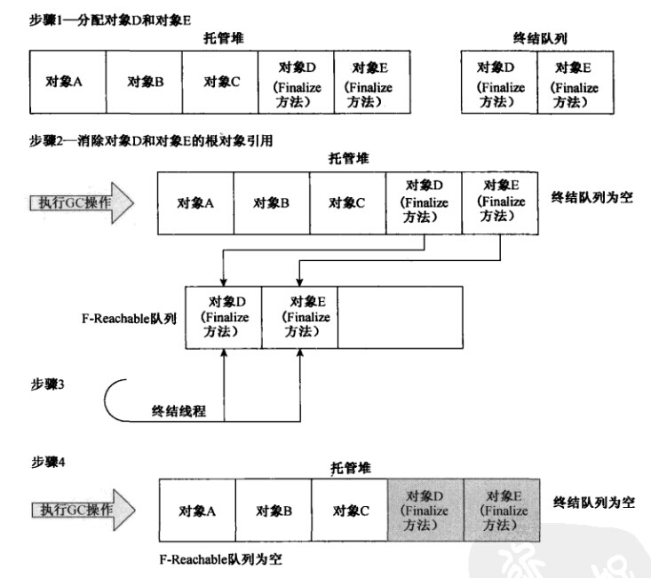

## 1 基础
### 1.1 从托管堆分配资源
CLR要求，所有的对象都从托管堆分配。应用程序的内存受进程的虚拟地址空间的限制。32位的进程最多分1.5G，64位最多分8T。连续分配，程序的引用**局部化**使得性能提升。加载CLR时，每个托管进程起都有两个堆，一个是大对象堆LOH，一个是小对象堆SOH。工作站模式中初始为16M，服务器模式中要更大。CLR的堆管理器会保留一部分内存空间，根据需要进行提交。小对象堆的内存被耗尽时，将触发GC，空间仍不足时，进行扩展；大对象堆内存被耗尽时，堆管理器提供一个新的内存段来提供内存。内存段都被回收时，就会释放该内存段。
### 1.2 垃圾回收算法
CLR使用一种引用跟踪算法。开始GC时，暂停所有线程，然后进行对象标记，先遍历堆中所有对象，标记其同步块中一位为0。然后，CLR检查所有活动跟，任何根引用到堆上的对象，就标记同步块索引中的一位为1，同时标记这些对象引用到的对象，发现对象被标记时，就不检查对象的字段，避免了因为循环引用而产生死循环。对象删除后，就进行内存紧缩阶段，这恢复了引用的“局部化”，减少了程序的工作集，从而提升访问这些对象的性能。压缩意味了解决了堆空间的碎片化问题。
**应用程序根**
- JIT 通过机器代码清楚的知道什么时候那些变量仍然活跃，JIT将这些信息放在一张表中，供GC查询；
- 栈遍历器
- 句柄表
- 终结队列
- 上述类别对象的成员

## 2 代
共有3代，分别为0、1、2，对新对象分配内存时，若0代的超过预算值，就会引起垃圾回收，开始垃圾回收时，会检查1代占用了多少内存，若远小于预算，只会进行0代垃圾回收，忽略1代的垃圾回收提升了垃圾回收器的性能，0代中没有被回收的对象提升到1代。垃圾回收的过程如下：  
初始，堆中没有对象，都分配到0代  
  
运行一定时间，C、E为垃圾，由于0代没有空间分配，所以进行垃圾回收，同时压缩内存。其它0代对象提升到1代  
  
新对象F-K分配到0代  
  
此时，发现H,J不可达，同时检查1代，但发现1代空间占用远小于预算，所以只进行0代垃圾回收，回收后如下  
  
继续分配对象L-O  
  
执行垃圾回收  
  
分配P-S,如下：  
  
再分配对象时，此时发现0代空间不足，需要进行垃圾回收，发现1代同样超过预算，便进行0、1代的垃圾回收，没有被回收的1代对象提升到2代。  
  
注：垃圾回收在回收第0代内存时，若没有多少对存活，CLR会增加0代的预算，这样，垃圾回收次数减少，但执行GC时耗时增加。相反，回收的内存多时，便会减小0代的预算。==垃圾回收器使用类似的算法调整第1代及2代的预算==。也就是说，垃圾回收器会根据应用程序的要求进行内存负载来自动优化。
### 2.1 垃圾回收触发条件
- 超过0代预算时触发
- 调用GC.Collect
- Windows报告内存低时
- CLR在卸载AppDomain
- CLR正在关闭
      
### 2.2 大对象
大于或等于85000个字节的对象。GC会避免在其上进行紧缩操作，而是使用一个空闲链表维护空闲内存，相邻空闲项会合并一起。
注：大对象总是第2代，只能为长时间存活的资源创建大对象，分配短时间存活的大对象会导致第2代被更频繁的回收，损害性能。
### 2.3 垃圾回收模式
- 工作站
  针对客户端程序优化GC
- 服务器
  针对服务端程序优化GC,多CPU计算机上运行。
还有两种子模式，分别是并发和非并发。并发方式中，垃圾回收器有一个额外的后台线程，在程序运行时并发标记对象。构造不可达对象集合，因而提升性能。  

### 2.4 强制垃圾回收
尽量避免手动进行垃圾回收，或在服务端客户端应用程序中，若进行一次完成的垃圾回收，耗时可能会很长，使得服务端请求超时，此时，可对RegisterForFullGCNotification进地监控，收到通知后，在一个更恰当的时间执行GC.Collect。
### 2.5 监视应用程序内存使用
GC类提供了可以监控某一代执行了多少次垃圾回收及堆中对象当前使用了多少内存。
```cs
Int32 CollectionCount(Int32 generation)
Int64 GetTotalMemory(Boolean forceFullCollection)
```
**相关监控工具**
- PerfMon.exe 
  .Net安装时附代的性能计数器
- PerfView
- SOS

## 3 特殊清理类型
### 3.1 使用包装了本机资源的类型
本机资源有：文件、网络连接、套接字、互斥体等，包装的类型有FileStream（使用文件句柄），Mutex（使用Windows互斥体内核对象）,GC会回收对象在托管堆中使用的内存，但无法释放本机资源（GC一无所知）,CLR提供了终结机制解决这个问题。可终结对象需要定义Finalize方法。语法结构如下：
```cs
internal sealed class SomeType{
	~SomeType()
    {
    	//这里释放本机资源
    }
}
```
注：
1. 其定义虽于C++中的析构语法相同，但不同的是，CLR中的析构并非确定性析构，即无法得知析构函数的确切调用时间。
2. 可终结对象在回收时必须存活，生存期变长，造成它被提升到上一次，同时，其所引入对象也被提升到上一代。尽量避免定义可终结类型。  
3. CLR使用一个特殊的，高优先级的专用线程调用Finalize方法。如果Finalize方法阻塞，该特殊线程就调用不了任何更多的Finalize方法，只要程序运行，就会内存泄漏，应小心。

**FCL中提供释放本机资源的辅助类SafeHandle**
Safehandle继承自CriticalFinalizerObject，首次构造其派生对象时，CLR立即对继承层次的所有Finalize方法进行JIT编译，可确保当对象为判定为垃圾时，本机资源肯定得以释放。
注：内存吃紧时，可能没有足够的内存编译Finalize方法，这会阻止Finalize方法的执行，造成内存泄漏；Appdomain被宿主应用应用程序强行中断，CLR将调用CriticalFinalizerObject派生类型的Finalize方法；CriticalFinalizerObject的Finalize方法总是在非CriticalFinalizerObject类型的Finalize方法之后调用，这样，托管资源类可以在自己的Finalize中成功的访问CriticalFinalizerObject，如FileStream可以放心的在自己的Finalize方法中将数据Flush到磁盘，它知道磁盘文件还未关闭。
使用：FileStream的内部实现就是包装了一个SafeFileHandle，该类间接继承自SafeHandle，从而确保文件句柄总可以释放。
实例：[FileStreamGC实例]([BC]FileStreamGC实例.md)
### 3.2 Dispose模式
如果想允许使用者控制类所包装的本机资源的生存期，就必须实现IDisposable接口。
注：如果类定义的字段实现了Dispose模式，那么该类也应该实现Dispose模式。如FileStream的实现：
```cs
FileSream fs = new FileStream("xxx.txt",FileMode.Open);
StreamWriter sw = new StreamWriter(fs);
sw.Write("xxx");
sw.Dispose();
```
注：如果不显式调用Dispose,某个时刻，垃圾回收器会检测到fs及sw均会不这达对象，但无法保证终结顺序，若fs先终结，sw会试图向已关闭的文件中写入数据，抛出异常。MS的解决方案：StreamWriter不支持终结，即永远不会将它的缓冲区数据Flush到底层的FileStream，也就是说忘记在StreamWriter上调用Dispose，数据肯定会丢失。

**Dispose模式的示例代码**
```cs
    public class BaseResource : IDisposable
    {
        private IntPtr handle; // 句柄，属于非托管资源
        private IDisposable comp; // 组件，托管资源
        private bool isDisposed = false; // 是否已释放资源的标志

        public BaseResource()
        {
        }

        //实现接口方法
        //由类的使用者，在外部显示调用，释放类资源
        public void Dispose()
        {
            Dispose( true); // 释放托管和非托管资源

            //将对象从垃圾回收器链表中移除，
            // 从而在垃圾回收器工作时，只释放托管资源，而不执行此对象的析构函数
            System. GC.SuppressFinalize( this);
        }

        //由垃圾回收器调用，释放非托管资源

        ~BaseResource()
        {
            Dispose( false); // 释放非托管资源
        }

        //参数为true表示释放所有资源，只能由使用者调用
        //参数为false表示释放非托管资源，只能由垃圾回收器自动调用
        //如果子类有自己的非托管资源，可以重载这个函数，添加自己的非托管资源的释放
        //但是要记住，重载此函数必须保证调用基类的版本，以保证基类的资源正常释放
        protected virtual void Dispose( bool disposing)
        {
            if (! this.isDisposed) // 如果资源未释放 这个判断主要用了防止对象被多次释放
            {
                if (disposing)
                {
                    comp.Dispose(); // 释放托管资源
                }

                // 释放非托管资源
                handle = IntPtr.Zero;
            }
            this.isDisposed = true; // 标识此对象已释放
        }
    }

```
> 调用Dispose不会将托管对象从托管堆中删除。只有在垃圾回收后，托管堆的内存才会得以释放。

### 3.3 GC为本机资源提供的其他功能
#### AddMemoryPressure及RemoveMemoryPressure
本机资源占用较多时，而包装其资源的托管资源占用很少的内存，GC的垃圾回收算法可能并不准确，这两个方法便是对此修正。
#### HandleCollector
用来创建有限的资源，超过数量时就会进行垃圾回收。
### 3.4 终结的内部工作原理

注：
1. 终结线程是一个高优先级的专用线程，CLR并不保证这些线程在何时启动执行。
2. 可终结对象无法通过一次垃圾收集操作就被回收，而是需要两次，也就是说，可终结对象被销毁前，通常都会被提升到1代，变成一种开销较高的对象。
    
### 3.5 手动监视和控制对象生存
CLR为每个AppDomain提供了一个GC句柄表，允许应用程序监视或手动控制对象的生存期。
**GCHandle**
- Weak
  监控对象的生命周期，对象被判定不可达，但可能还在内存中。
- WeakTrackResurrection
  监控对象的生命周期，对象不在内存中。
- Normal
  固定对象，不会回收该对象，会晕行内存压缩
- Pinned
  固定对象，不会回收，不会更改其内存位置
注：使用CLR的P/Invoke机制调用方法时，CLR会自动帮你固定实参，并在方法返回时自动解除;C#提供了一个fixed语句，它能在代码块中固定对象。

**WeakRefrence<T>**
**ConditionalWeakTable<TKey,TValue>**
将一些数据与另一个实体关联，key是弱引用，若key在内存中，值一定在内存中。

**引用**
[1] http://www.cnblogs.com/justinli/p/GC.html
[2] CLR via C#托管堆与垃圾回收
